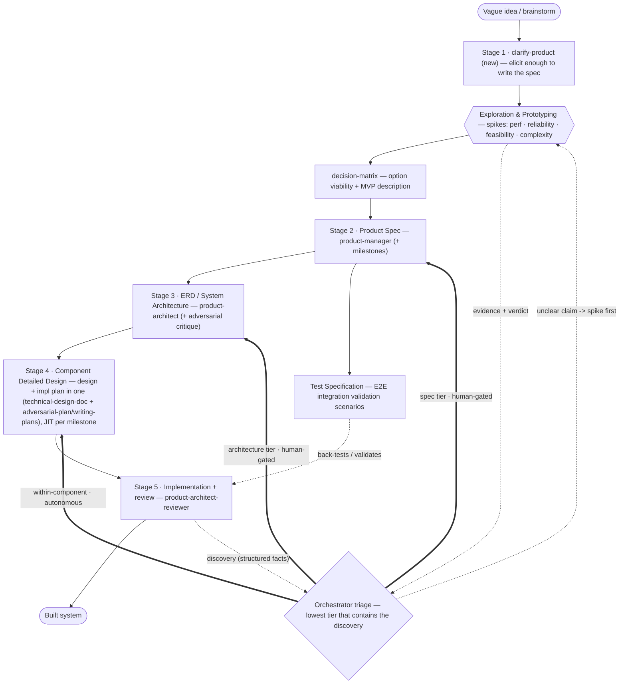
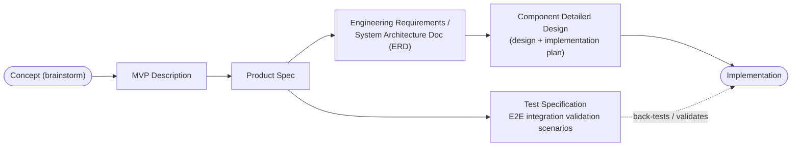
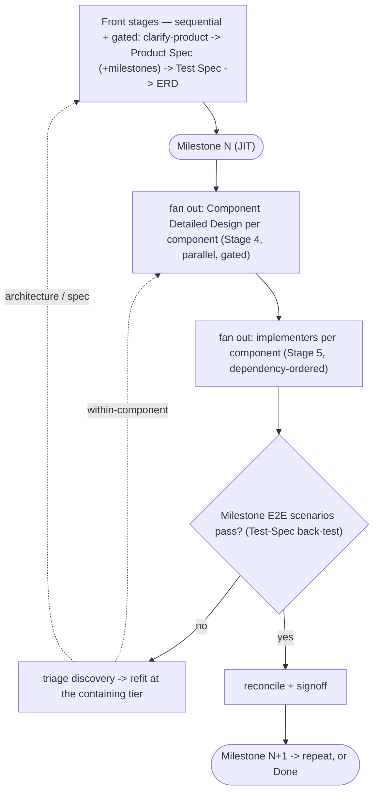

# System-Dev Pipeline — Design

**Status:** draft · R1 review + prototyping + clarify-product + test spec + split product roles (standalone skills) + combined component detailed design + plugin packaging + execution workflow + artifact-path layout + critic-per-artifact · substrate: **markdown work log** (beads deferred) · **Date:** 2026-06-29 (rev 2026-07-01) · **Tracking:** `adp-4` (see `system-dev-pipeline-log.md`)
**Working name:** `system-dev-pipeline` (provisional)

## Summary

A skill that takes a **vague idea to a built system** through a chain of named, gated, durable artifacts — **concept → MVP description → product spec → engineering-requirements / system-architecture doc → component detailed designs (design + implementation plan) → implementation** — with a **test specification** branched off the product spec that back-tests the final build, and a **feedback loop** so what implementation *learns* refits work at the right altitude (within a component, the architecture, or the spec) instead of papering over it. **Prototypes (spikes) are a first-class tool throughout** — fired up front to explore options and find the MVP, and on demand at any point to settle an unclear design claim with real numbers rather than introspection.

The front gate is a **new `clarify-product`** skill (built on `clarify-task`) whose job is to get enough out of the brainstorm that a *proper product spec* can be written. The rest composes tools we already have, each used for what it is built to do:
- **`clarify-product`** (new, from `clarify-task`) → elicit the concept into an **MVP description** + the inputs a product spec needs,
- **`product-manager`** (split from product-architect Ph1) → the **Product Spec**, and reviews product-spec changes; a **milestone-slicing** step derives the delivery milestones,
- **test-spec generator** (new) → the **Test Specification** (E2E integration validation scenarios) from the product spec,
- **`product-architect`** (split from product-architect Ph2, + optional adversarial critique) → the **ERD / System Architecture** (components, interfaces, deps, build order),
- **`technical-design-doc`** (with `adversarial-plan`/`writing-plans` for the plan portion) → per-component **Component Detailed Design** — design *and* implementation plan in one artifact, JIT per milestone, straight from the ERD's component scoping; **`lightweight-design-doc`** then derives a condensed summary for tech-lead review (it does **not** originate designs),
- **`product-architect-reviewer`** (split from product-architect Ph4–5) → dispatch implementers, review, adjust,

The three `product-*` roles are **standalone skills in the plugin, split out from the `product-architect` monolith and named by the artifact format each enters at** — `product-manager` (product spec), `product-architect` (ERD), `product-architect-reviewer` (implementation) — so it's obvious which skill owns which gate and refit tier, and each can be optimized independently. (See **Plugin packaging**.)

This all runs over a **markdown work log + linked manifest** as the durable substrate. (A graph issue-tracker like **beads** could replace the manifest later, but that choice is **deferred** — not yet evaluated against the in-Meta workflow.) The novel contributions are the **3-tier feedback/escalation loop**, the **traceability spine** the orchestrator builds and maintains, the **test-spec back-test**, and the **gating capability** the orchestrator adds around each artifact.

## Pipeline at a glance (process + feedback)



**Reading it:** solid arrows are the forward pipeline (each forward step crosses a **signoff gate**). Thick arrows are feedback-loop **refits** — the orchestrator triages each implementation discovery to the lowest tier that contains it (**within-component = autonomous; architecture & spec = human-gated**). Dotted arrows are the **discovery / evidence / validation** flow: prototypes settle unclear claims with real numbers; the Test Specification back-tests the implementation.

## Durable artifact pipeline

The artifacts below are the **durable handoffs and the source of truth** — each is named, signed off, and returnable to. The test specification branches off the product spec and validates the implementation at the end (and at each milestone boundary).



| # | Durable artifact | Produced by | Gate |
|---|---|---|---|
| 1 | **Concept** | brainstorm (`10x-engineer:brainstorming`) | — |
| 2 | **MVP Description** | `clarify-product` (new) + Exploration & Prototyping | signoff |
| 3 | **Product Spec** (+ milestones) | `product-manager` + milestone-slicing | signoff |
| 3t | **Test Specification** (E2E scenarios) | test-spec generator (new) | signoff |
| 4 | **ERD / System Architecture** | `product-architect` (+ adversarial critique) | signoff |
| 5 | **Component Detailed Design** — design + implementation plan (JIT per milestone) | `technical-design-doc` (originates) + `adversarial-plan`/`writing-plans` (plan portion) | signoff |
| 5r | **Component Design review summary** (derived) | `lightweight-design-doc` (from the detailed design) | tech-lead review |
| 6 | **Implementation** | `product-architect-reviewer` | review + **Test-Spec back-test** |

(Gating is a capability the **orchestrator** adds — it publishes each artifact and runs an mdoc-monitor signoff. Only `adversarial-plan` does mdoc+signoff natively today; the others gate in-conversation, so the orchestrator wraps them — R1 correction C5.)

## Why this exists

On larger systems, "idea → code" loses requirements/architecture decisions, never writes down how the result will be *validated*, and has nowhere to put the inevitable mid-build discovery ("this interface is wrong", "this requirement is infeasible"). We want explicit, signed-off artifacts you can return to, an E2E validation contract fixed early, and a disciplined way for implementation reality to flow *back up* to the smallest artifact that must change.

## clarify-product: the new front gate

`clarify-task` (just optimized) is built for **fast task-framing** — turn a vague ask into a lean goal with the fewest questions. Writing a **product spec** needs more: users, core capabilities, success metrics, constraints, non-goals, and the seed of an MVP. So the front gate is a **separate `clarify-product` skill, based on `clarify-task`'s elicitation patterns** but tuned to gather enough for a proper product spec without tipping into a full research project. Its output is the **MVP Description** plus the elicited material the **`product-manager`** skill formalizes. (Name alternative considered: `clarify-scenario`; chose `clarify-product` because the intent is product-spec readiness — see Open Questions.)

## Test specification: the validation contract

Derived from the **Product Spec** (not from the code), the **Test Specification** defines **E2E integration validation scenarios** — the user-visible behaviors and cross-component flows that must hold for the product to be "done." It is fixed early so it can **back-test the final implementation** and is the acceptance backbone at every **milestone boundary** (a milestone's E2E slice is "done" when its scenarios pass). Each scenario maps to one or more product requirements (`REQ-*`) on the spine and becomes an acceptance check on the relevant milestone/component, so a scenario that fails is a first-class, dependency-gating discovery. Writing it from the spec (rather than the implementation) is what makes it a real contract instead of a rationalization of whatever got built.

## Prototyping (spikes): evidence over introspection

A **prototype** isolates and tests a specific, load-bearing claim about a design **with real numbers, real code, and executing tests** — answering questions introspection on code cannot: **performance** (benchmark it), **reliability** (inject failures), **feasibility** (does the approach/dependency even work?), and **complexity** (how much code / how hard, measured not guessed). Its deliverable is **evidence + a verdict**, not shippable code.

**Two ways it enters the pipeline:**
- **Up front (Exploration & Prototyping):** before committing to an architecture, prototype the riskiest / most-uncertain options. This is where we *find the MVP*. Prototyping surfaces options we hadn't considered and **kills options that turn out non-viable**, then feeds the **`decision-matrix`** with *measured* values instead of speculation. Decision matrices reduce engineering effort and align priorities — but only if the options are real and viable; prototyping is what makes them real before we matrix them.
- **On demand, at any point (the evidence arm of the feedback loop):** any time a design claim is genuinely unclear — at any tier — fire a prototype to settle it. In particular, **before an expensive arch or spec refit whose direction hinges on an unclear claim, prototype first**, then refit on real numbers rather than re-deriving on a guess.

**Discipline (so prototyping stays cheap):**
- **Question-first:** every prototype names the exact claim it tests and its **success / kill criteria** up front — a prototype with no kill criterion is a side project, not a spike.
- **Time-boxed:** a prototype has a budget; it is an investigation, not production. (Mirrors the anti-bloat / proportionality discipline — only prototype the genuinely-unclear, load-bearing claims; don't spike the obvious.)
- **Throwaway by default:** the *evidence* persists; the *code* usually does not. A clean prototype **may** graduate into the milestone-1 walking-skeleton seed, but "prototype quietly becomes prod" is an anti-goal.
- **Feeds a decision or a refit:** every prototype's verdict lands somewhere — a decision-matrix cell, an architecture choice, or a tier refit — and is recorded on the spine.

**Tracked on the spine:** a prototype is a spike entry in the manifest — the claim, its **kill criteria**, and its **evidence + verdict** — linked to the decision/design it informs and to the discovery that spawned it (if any). Throwaway code lives on a scratch branch; the durable record is the evidence.

## Two orthogonal axes: components × milestones

- **Decomposition — "component detailed designs":** the architecture's components broken into a per-component **detailed design that includes its implementation plan** — the **farm-out units** across teammates. The ERD's component scoping is detailed enough to jump straight here from the high-level requirements (no separate design-then-plan step). Structural.
- **Delivery — "milestones":** vertical slices (from milestone-slicing on the product spec) that exercise the product E2E and prove primary infra. The **MVP** = a compelling feature set *and* the major components stood up enough to be **iterated in isolation** afterward.

Work grid = **components × milestones**. Milestone 1 (MVP / walking skeleton) is the big early de-risk: it exercises the cross-cutting interfaces end-to-end so interface-invalidating discoveries surface when a re-architect is cheap — and its E2E scenarios from the Test Spec are the first to go green.

## Just-in-time, milestone-scoped design

- **Architecture (ERD) is full up front and milestone-set-aware** — designs for the whole journey so a later milestone doesn't paint us into a corner. It's the stable spine.
- **Component detailed designs (design + plan) and implementation are JIT and milestone-scoped (YAGNI)** — produced just before building that milestone, focused only on it; keeps each build simple, keeps detail adaptive to feedback, and bounds planning cost to the current milestone.

## The feedback loop (the novel core)

The **orchestrator** (which holds the traceability spine) triages each implementation discovery to the **lowest tier that contains it** and drives the **minimal** refit. Implementers don't classify — a context-free implementer structurally can't tell local from cross-component (R1 correction C6); it just **reports discoveries as structured facts** ("had to change interface X", "requirement Y infeasible", "E2E scenario S fails", "perf target missed"), and the orchestrator classifies using the spine.

| Tier | Trigger examples | Refit action | Gate |
|---|---|---|---|
| **Within-component** (detailed design + plan) | a test fails; cleaner local approach; component-internal structure change — nothing crosses an interface | adjust that component's **detailed design (design + plan)** (the `product-architect-reviewer`'s existing adjust path) | **autonomous** |
| **Architecture** | interface wrong/insufficient; component can't meet perf/scale; dependency infeasible/behaves differently; component assumptions collide; build-order assumption breaks | **scoped re-plan**: re-run the `product-architect` skill (+ optional adversarial critique) on the affected subsystem **with current artifacts as input**, then **diff/merge** into the spine | **human-gated** |
| **Spec** | requirement infeasible/contradictory; cost flips cost-benefit; non-goal turns out load-bearing; need shifted; an E2E scenario is wrong | `product-manager` re-runs `clarify-product` / revises the **Product Spec** on the affected slice — **and re-derives the affected Test-Spec scenarios** — then merge | **human-gated** |
| **External** | dependency team breaking change; new constraint/SEV mid-build | classified into one of the above | per landing tier |

**Tier-spanning discovery → take the highest tier** (a spec change implies architecture + component-detailed-design refits below it, and a Test-Spec re-derivation).

**Honesty about "scoped":** re-running a planner on a subsystem is **scoped re-derivation + merge**, not a surgical in-place edit — these skills draft from a prompt, not from a diff (R1 correction C2). The discipline is: feed the current artifacts in as context, scope tightly to the affected subtree, and have the orchestrator merge the result back into the spine (re-pointing the manifest's dependency links). The *win* over full re-derivation is the tight scope + the spine telling us exactly what to re-plan and what to leave alone.

**Prototype before an expensive refit.** When an arch/spec refit's *direction* depends on an unclear claim (will the new interface meet latency? is the alternative dependency reliable enough?), fire a prototype first and refit on the resulting numbers — don't re-derive on a guess (see Prototyping). The prototype's verdict is itself a spine artifact, so the refit decision is auditable.

### Traceability spine (orchestrator-built — R1 correction C3)

No existing skill emits a full spine, so the **orchestrator builds it** in the markdown manifest: it assigns IDs at each stage — `REQ-*` (product-spec requirements), `SCN-*` (Test-Spec E2E scenarios), component IDs and `IFC-*` (interfaces), detailed-design IDs, task IDs — and records the links `REQ → SCN`, `REQ → component/IFC → component-detailed-design → impl-task` (seeded by product-architect's requirements-traceability table). After any refit, a **spine-resync step** updates the affected links and dependency edges so the ready-work order and the back-test re-gate correctly.

## Control model: artifact-centric, resumable orchestrator

A large build outlives any session, so the **markdown artifacts + manifest ARE the durable state**; the orchestrator is a thin, stateless driver that runs the happy path *or* resumes at any stage by reading the artifacts + manifest. Every refit is an auditable, logged edit to the spine; a milestone can be handed to a teammate.

## Execution workflow (E2E run + component fan-out)

The `build-it` orchestrator skill runs the pipeline as a **workflow** — a deterministic control flow over the stages, with **parallel fan-out** where the work is independent and **human gates** where a signoff is required. This workflow is the thing that "runs the E2E execution and all the components."



**Shape of the run:**
1. **Front stages are sequential + gated** — each emits an artifact, the orchestrator publishes it, waits for signoff, then proceeds. Prototypes may be fired at any point (the evidence arm).
2. **Per milestone (outer loop), JIT:** (a) **fan out over components** — one Component Detailed Design per component in the milestone's slice, in parallel (bounded), gated; (b) **fan out implementers** per component, respecting the dependency/build order — this is where "all the components" get built; (c) **run the E2E back-test** — the milestone's Test-Spec scenarios must pass.
3. **Milestone boundary → reconcile + signoff → next milestone**, folding in what was learned.
4. **Feedback loop = workflow re-entry:** a discovery re-enters at the triaged tier (within-component → that component's Stage 4/5; architecture/spec → the front stages, scoped to the affected subtree). Downstream work is withheld until the refit's gate clears.

**How we proceed between stages (the transition rule):** advance only when the current artifact is (a) **produced**, (b) **signed off** at its gate (autonomous for within-component; human for arch/spec/milestone), and (c) its **spine links + `path` are recorded**. A stage that fails its gate — or whose E2E scenarios don't pass — does **not** advance; it triggers a refit at the appropriate tier. Component-level stages advance **per-component** as each clears; a **milestone** advances only when all its components *and* its E2E scenarios are green.

This maps onto a workflow engine's primitives: **sequential phases** (front stages, milestone boundaries), **parallel fan-out** (components within a milestone), **loops** (milestones; feedback re-entry), and **barriers/gates** (signoffs, the milestone E2E back-test).

## Critics (quality gates)

**Every authored artifact has a paired critic** — a gate passes on a critic's
**verdict**, not on "LGTM", making quality structural rather than hoped-for.

- **Engine:** the critic runs independently → **severity-graded** findings (reuse
  `adversarial-diff-review`'s forkable HIGH/MED/LOW × confidence rubric) →
  **VERDICT: APPROVE | NEEDS-REVISION**. APPROVE clears the gate (+ human signoff at
  arch/spec/milestone); NEEDS-REVISION findings enter the feedback loop as refit
  discoveries, then re-critique. Stakes dial: routine → one `csc:grill` pass;
  high-stakes (spec, ERD) → cross-model / multi-agent.
- **Per-artifact map** (installed default → upgrade): MVP desc → `csc:grill`;
  Product Spec → `csc:grill` / `devils-advocate`\* → `prd-quality-check`\*; **Test
  Spec → `test-spec-critic` (new, in-plugin)**; ERD → `10x-engineer:design-review`
  (+ `adversarial-plan` critique) → `plan-review`\*; component detailed design →
  `adversarial-plan` / `csc:grill` → `adversarial-review`\*; implementation →
  `review-code` / `paladin` / `adversarial-diff-review` + `product-architect-reviewer`.
  (\* marketplace, not yet installed.)
- Operational detail: `references/conventions.md` (§ Critics); full survey +
  install candidates: `CRITICS-SURVEY.md`. The Test Spec was the only artifact with
  no existing critic → we authored `test-spec-critic`.

## Partial-failure & lifecycle handling (R1 correction C7)

- **In-flight implementers when an arch refit lands:** reuse the `product-architect-reviewer`'s existing mechanism — adjust sibling/downstream component detailed designs, send updated guidance to in-flight implementers, re-review already-completed siblings for compatibility. New work is withheld until the refit is signed off (the manifest marks the dependents blocked).
- **A planner run aborts** (`adversarial-plan` refuses single-agent fallback): the orchestrator surfaces the failure and resumes from the last good artifact — no silent degraded output.
- **Milestone boundary:** at the end of a milestone, reconcile (all components compatible, traceability walked, **the milestone's Test-Spec E2E scenarios pass**, drift checked), sign off, *then* JIT-design the next milestone — folding in everything the just-finished milestone taught.

## Cost & proportionality rule (R1 correction C8)

`adversarial-plan` is expensive (~15–25 CLI calls + a human gate per run). Calling it for every component every milestone plus every refit explodes. Rule:
- **Reserve `adversarial-plan`** for (a) the architecture-hardening critique and (b) the **plan portion of high-risk / novel / cross-cutting** component detailed designs.
- **Use single-agent `writing-plans`** for the plan portion of routine components. The **component detailed design always originates from `technical-design-doc`** (the full TDD, scoped to the milestone per JIT/YAGNI, with the implementation plan folded in) — `lightweight-design-doc` is **not** a cheaper originator; it only derives a condensed summary for tech-lead review.
- **Budget per milestone**, and **collapse stages for small work** — the skill must be proportionate (dogfooding the anti-bloat lessons from the clarify-task / adversarial-plan optimizations). A small task should not trigger the full pipeline; trivial tasks may collapse clarify-product+spec into one step and use a minimal component detailed design.

## Work substrate: markdown (beads deferred)

The substrate is a **markdown work log + linked manifest** — human-readable, diff-able, no external dependency. The **traceability spine, work tracking, ready-order, and escalation gating live in the manifest** (IDs + status + typed dependency links). This is deliberately simple: it needs no daemon and survives anywhere.

**Beads is deferred, not chosen.** A graph issue-tracker (e.g. `beads`/`bd`) could later replace the manifest and give a real dependency-resolved "ready" queue, but we are **not committing to it** until we understand how it fits the in-Meta workflow. The design does not depend on it; the manifest schema below is intentionally close to a generic issue-graph so adopting one later is mechanical if we choose to.

**Manifest schema:** `id`, `type` (epic|task|spike|scenario), `status`, `priority`, `milestone`, `path` (the artifact file this entry points at), `deps` {`blocks`, `parent`, `relates`, `supersedes`, `discovered-from`, `informs`, `satisfies` — cross-level: REQ↔SCN↔component↔detailed-design↔task}, `design`, `acceptance`.

## Artifact paths (run layout) — historical record

Every artifact persists at a **known path** under a per-product **run root**, so the full history is inspectable and returnable-to. Refits never silently overwrite: a superseded version is moved under `history/` and the manifest entry gains a `supersedes` link to it. The run root *is* the durable, resumable state — the orchestrator rebuilds context from `manifest.md` plus the `path`s it names.

```
runs/<product-slug>/
  manifest.md                         # the spine + work log (id, status, deps, path per entry)
  concept.md                          # REQ source: the brainstorm concept
  mvp-description.md
  product-spec.md                     # REQ-*
  test-spec.md                        # E2E integration validation scenarios (SCN-*)
  architecture/erd.md                 # ERD / system architecture (components, IFC-*)
  decision-matrix/<decision>.md
  prototypes/<spike-id>.md            # spike claim + kill-criteria + evidence + verdict
  milestones/<m>/
    components/<component>/detailed-design.md   # design + implementation plan
    components/<component>/review-summary.md      # derived (lightweight-design-doc)
    e2e-results.md                    # this milestone's Test-Spec back-test results
  signoffs/<artifact>.md              # gate approval records (mdoc links / verdicts)
  history/<artifact>@<rev>.md         # superseded versions, kept for the record
```

Rules: (1) each stage writes to its canonical path and records that `path` on its manifest entry; (2) a refit writes the new version to the canonical path and moves the prior one to `history/…@<rev>.md`, linked by `supersedes`; (3) `prototypes/`, `decision-matrix/`, `signoffs/`, and `history/` are **append-only** — they are the audit trail of how the system got to its current shape. `<rev>` is a monotonic counter (or a timestamp supplied at run time), not derived inside the workflow.

## Composition / reuse

| Piece | Reuse / build | Role |
|---|---|---|
| `10x-engineer:brainstorming` | reuse | Concept: brainstorm the idea |
| **`clarify-product`** | **build new** (plugin · from `clarify-task`) | Stage 1: elicit → MVP description + product-spec inputs |
| **prototype / spike runner** | **build new** (plugin) | Exploration + on-demand: focused experiment, run tests/benchmarks, return evidence+verdict |
| `decision-matrix` | reuse | Choose among prototyped options on measured criteria |
| `product-manager` (from product-architect Ph1) | **build new** (plugin · split) | Stage 2: author the Product Spec; review product-spec changes |
| **milestone-slicing step** | **build new** (plugin) | derive milestones from the product spec |
| **test-spec-generator** | **build new** (plugin) | Stage 3t: E2E integration validation scenarios from the product spec |
| `product-architect` (from product-architect Ph2) | **build new** (plugin · split) | Stage 3: define the ERD / System Architecture + traceability table |
| `technical-design-doc` | reuse | Stage 4: **originate** the component detailed design (full TDD, milestone-scoped, includes the implementation plan) |
| `adversarial-plan` | reuse | architecture-hardening critique + plan portion of high-risk component detailed designs |
| `writing-plans` | reuse | plan portion of routine component detailed designs |
| `lightweight-design-doc` | reuse | derive a condensed detailed-design summary for tech-lead review (does **not** originate designs) |
| `product-architect-reviewer` (from product-architect Ph4–5) | **build new** (plugin · split) | Stage 5: dispatch implementers, review, adjust |
| markdown work log + manifest | **build new** (plugin) | the durable substrate + spine (beads deferred) |
| **orchestrator** (`build-it`): pipeline driver + gating wrapper + tier-triage + spine + back-test | **build new** (plugin) | the **single registered skill** / `/build-it` command |

## Plugin packaging

All the stages ship as **one plugin** (provisional name `system-dev-pipeline`) so they can be **scoped as a unit, versioned together, and tightly interwoven** — shared manifest/spine conventions, a common gating mechanism, and a single orchestrator entry command. Packaging also lets each stage skill be **optimized independently** (the way `clarify-task` and `adversarial-plan` already were) while staying coherent. Layout mirrors existing plugins: `.claude-plugin/plugin.json`, `skills/`, `agents/`, `commands/`, `hooks/`.

**Plugin-local skills (built here):**
- `system-dev` — the **orchestrator** (pipeline driver + gating + tier-triage + spine + Test-Spec back-test); backs the `/system-dev` command.
- `clarify-product` — front gate (from `clarify-task`).
- `product-manager` — Product Spec authoring + spec-change review (**split from `product-architect` Ph1**).
- `milestone-slicing` — derive milestones from the product spec.
- `test-spec-generator` — E2E integration validation scenarios from the product spec.
- `product-architect` — ERD / System Architecture (**split from `product-architect` Ph2**).
- `prototype-runner` — spikes (evidence over introspection).
- `component-detailed-design` — combine `technical-design-doc` + `adversarial-plan`/`writing-plans` into the one design+plan artifact.
- `product-architect-reviewer` — dispatch implementers, review, adjust (**split from `product-architect` Ph4–5**).

**`agents/`:** the context-free **implementer** and **reviewer** subagent personas used in Stage 5.
**`hooks/`:** `SessionStart` to load the manifest/spine into context; usage tracking.
**Reused (invoked, not packaged):** `adversarial-plan`, `technical-design-doc`, `lightweight-design-doc`, `writing-plans`, `decision-matrix`, `10x-engineer:brainstorming`.

Splitting `product-architect` into three named skills (rather than calling phases of the monolith) is what makes the role↔gate↔refit-tier mapping explicit and each role independently improvable — and the plugin is the unit that keeps the nine skills and their shared spine/gating conventions interwoven.

## Open questions (genuinely still open)

1. **`clarify-product` naming & scope:** `clarify-product` vs `clarify-scenario`; and where the line sits between `clarify-product` and the `product-manager` skill. Lean: `clarify-product` stops at "enough to write the spec," `product-manager` formalizes.
2. **Product roles → standalone plugin skills (resolved):** `product-architect` is split into `product-manager` (from PA Ph1), `product-architect` (ERD, from PA Ph2), `product-architect-reviewer` (from PA Ph4–5). The monolith's phase logic is the source material.
3. **Test-spec generator:** new step from scratch vs leaning on existing test skills; who authors the scenario diff when the spec refits (the spine handles re-derivation).
4. **Triage authority:** autonomous tier classification (arch/spec human gate as the check) vs always human-confirmed. Lean: autonomous classify + propose, human gate at arch/spec.
5. **External-trigger detection:** manual entry vs a watcher for dependency/SEV changes.
6. **Gate weight:** full mdoc+monitor per artifact vs lighter inline approval for low-stakes milestones (tie to the proportionality rule).
7. **Work-substrate choice (deferred):** markdown log + manifest for now. Whether/when to adopt a graph tracker (e.g. beads) is deferred until we understand the in-Meta workflow — the design intentionally doesn't depend on it.
8. **Prototype lifecycle:** throwaway-by-default vs graduation to the walking-skeleton seed; who fires one (orchestrator auto-proposes on an unclear load-bearing claim, human confirms); default time-box.

## Phased build plan (tracked in `system-dev-pipeline-log.md`)

1. **ADP-4** (this doc): design — *in review*.
2. **ADP-11:** scaffold the **`system-dev-pipeline` plugin** (`.claude-plugin/plugin.json`, `skills/` `agents/` `commands/` `hooks/`) — the container for everything below. *Blocked by ADP-4.*
3. **ADP-12:** **split `product-architect`** into three plugin skills — `product-manager`, `product-architect`, `product-architect-reviewer`. *Blocked by ADP-11.*
4. **ADP-9:** **`clarify-product`** skill (from `clarify-task`). *Blocked by ADP-11.*
5. **ADP-10:** **test-spec-generator** skill (E2E scenarios from the product spec; milestone back-test). *Blocked by ADP-11.*
6. **ADP-5:** **`build-it` orchestrator** skill (the single registered entry) — pipeline driver + gating wrapper + markdown spine + 3-tier triage + prototype-runner + decision-matrix + Test-Spec back-test; loads stages from `references/stages/`. *Blocked by ADP-11.*
7. **ADP-8:** markdown spine/manifest tooling for the pipeline (ID scheme, dependency links, ready-order, export). *Blocked by ADP-11.*
8. Independent follow-ups: **ADP-6** clarify round-3; **ADP-7** clarify groundedness-metric fix.

## Success criteria

- One-paragraph idea → signed-off **MVP description, product spec (+ milestones), test specification, ERD, and milestone-1 component detailed designs** — each gated, no decisions lost between stages.
- The **Test Spec's E2E scenarios are authored from the product spec** and the final implementation is **back-tested** against them; each milestone closes only when its scenarios pass.
- A simulated mid-build discovery is triaged to the minimal tier; affected downstream work is withheld until the refit is signed off; the refit is an auditable spine edit (and a spec refit re-derives the affected E2E scenarios).
- A prototype kills or validates a design option with **real numbers** and that verdict visibly drives a decision-matrix cell or a tier refit — evidence over introspection.
- The run resumes from the markdown artifacts + manifest alone after a session loss; the skill is proportionate — small tasks don't get the heavyweight pipeline.

## Appendix: R1 adversarial review

An independent reviewer (read all three skill files) returned **NEEDS_REVISION** with 8 critical issues, all incorporated: C1 composition inversion (adversarial-plan emits plans, not architecture; product-architect owns product spec + architecture); C2 "scoped re-plan" honesty; C3 orchestrator-built spine + IDs; C4 milestones are a separate slicing step; C5 gating is an orchestrator-added capability; C6 orchestrator (not implementer) triages; C7 partial-failure/in-flight/milestone-boundary handling; C8 cost/proportionality rule. Full review: `system-dev-pipeline-design-review-1.md`. (Post-R1 evolution: `clarify-product` front gate, durable-artifact diagram, Test Specification, split product roles into standalone skills, merged Component Detailed Design, plugin packaging. Substrate: markdown work log; a beads trial was reverted — 2026-07-01 — pending understanding the in-Meta workflow.)
